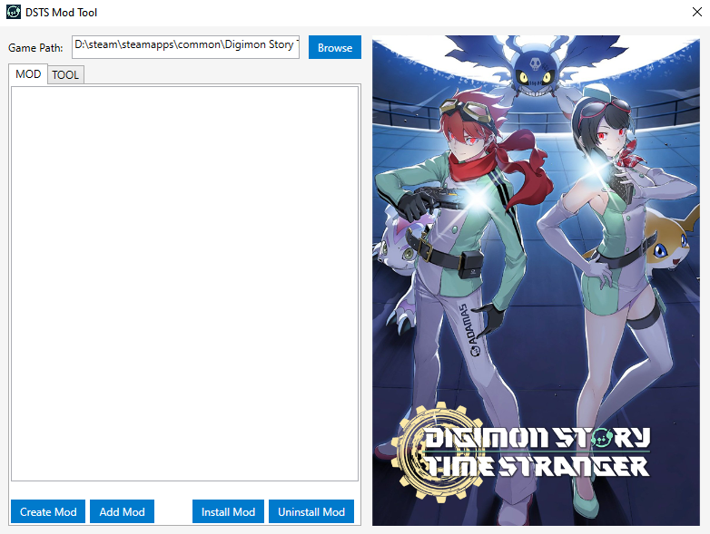
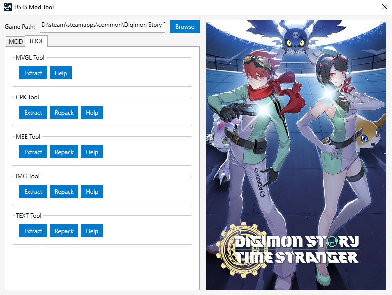

# Digimon Story: Time Stranger Mod Tool

A comprehensive GUI application for creating, managing, and installing mods for Digimon Story modding community, supporting mod creation, installation, and file processing tools like MVGL extractor, CPK packer, MBE editor, image processor, and text editor.

## Table of Contents

- [Features](#features)
- [Screenshots](#screenshots)
- [Requirements](#requirements)
- [Installation & Setup](#installation--setup)
- [Usage Guide](#usage-guide)
- [Keywords](#keywords)
- [Contributing](#contributing)
- [License](#license)

## Features

### MOD Management
- **Create New Mods**: Generate mod templates for Data or Language mods
- **Mod Installation**: Install mods with type selection (Data/Language)
- **Mod Uninstallation**: Safely remove installed mods
- **Mod List Management**: View and manage all available mods with drag-and-drop support

### Integrated Tools
- **MVGL Tool**: Extract and view 3D model files (.mvgl)
- **CPK Tool**: Pack and unpack game archives (.cpk)
- **MBE Tool**: Edit model files (.mbe)
- **IMG Tool**: Process image textures
- **TEXT Tool**: Handle text and localization files

## Screenshots

<!-- Add screenshots here -->

## Requirements

- .NET 8.0 or later
- Windows 10 or higher
- Digimon Story: Time Stranger game installed

## Download

Download the latest release from [Releases](https://github.com/levi-soft/DSTS-Mod-Tool/releases).

## Usage Guide

1. **Game Path Setup**: Click "Browse" to select your Digimon Story: Time Stranger installation directory
2. **Mod Creation**: Use the MOD tab to create new mods with custom structures
3. **Mod Installation**: Select mods and choose installation type
4. **File Processing**: Use TOOL tab for extracting/packing game files

## Keywords

Digimon Story Time Stranger, Mod Tool, GUI Application, PC Modding, Game Mods, MVGL Extractor, CPK Packer, MBE Editor, Image Processor, Text Editor

## Contributing

Contributions welcome! Please feel free to submit issues and pull requests.

## Acknowledgments

This project uses and gratefully acknowledges the following open-source tools and libraries:

- **DSCSTools**: [SydMontague/DSCSTools](https://github.com/SydMontague/DSCSTools) - Used for DSCSToolsCLI.exe
- **YACpkTool**: [Brolijah/YACpkTool](https://github.com/Brolijah/YACpkTool) - Used for YACpkTool.exe
- **THL-MBE-Parser**: [Ahtheerr/THL-MBE-Parser](https://github.com/Ahtheerr/THL-MBE-Parser) - Used for MBE_Parser.py and MBE_Repacker.py
- **Compressonator**: [GPUOpen-Tools/compressonator](https://github.com/GPUOpen-Tools/compressonator) - Used for compressonatorcli.exe

Special thanks to the developers of these tools for their contributions to the modding community.

## License

Open source project. Individual tool licenses may apply - please check respective tool documentation.